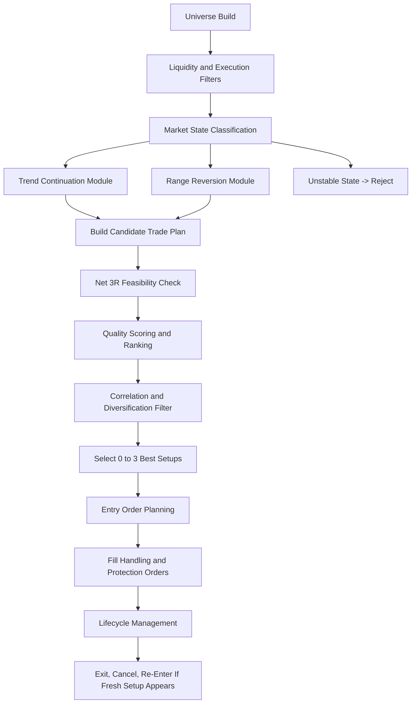
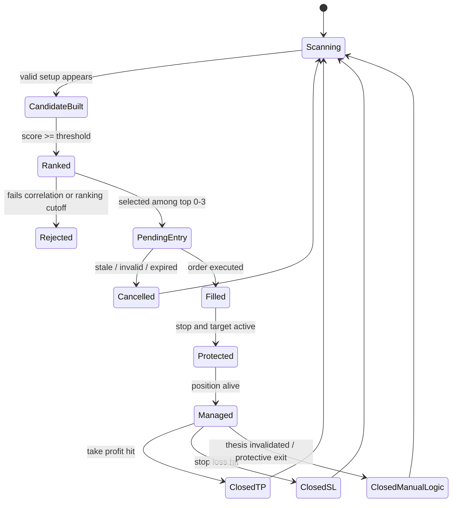

# Adaptive Quality-Ranked Regime Strategy (AQRR)
## Full Professional Strategy Specification for a Fully Automated Binance USD-M Futures Trading Bot

**Document type:** Final strategy selection and execution specification  
**Language:** English  
**Version:** 1.0  
**Date:** 2026-04-08  
**Status:** Production-grade strategy design document

---

## 1. Executive Decision

### 1.1 Selected strategy

The single best strategy for the stated requirements is the **Adaptive Quality-Ranked Regime Strategy (AQRR)**.

AQRR is not a single rigid entry pattern. It is a **unified strategy engine** that:

- scans a broad Binance USD-M universe,
- classifies each symbol by market regime,
- generates only regime-appropriate setups,
- scores each setup by real tradability and expected quality,
- ranks all valid opportunities cross-sectionally,
- selects **0 to 3** best setups only,
- enforces a **minimum net risk-to-reward of 1:3**,
- filters execution-unfriendly or highly correlated trades,
- and manages the complete trade lifecycle automatically.

### 1.2 Why AQRR is the best fit

AQRR is the strongest match because it satisfies all of the important requirements **at the same time**:

1. **Adaptive, not rigid**  
   The requirement explicitly rejects a single fixed style such as only breakout, only pullback, only trend-following, or only mean reversion. AQRR solves this by using a **regime engine** that decides which setup family is valid for each symbol at that moment.

2. **Quality over quantity**  
   The strategy is built around a **no-trade-first principle**. If nothing is good enough, it does nothing. This directly matches the requirement to avoid forced trades.

3. **Top-3 ranking logic**  
   AQRR is a ranking system by design. It can evaluate many symbols and promote only the **best 0 to 3 opportunities**.

4. **Long and short support**  
   Both directional sides are native to the design.

5. **Execution-aware for a very small account**  
   The strategy explicitly includes symbol filters, spread filters, slippage estimation, minimum notional checks, commission awareness, leverage bracket checks, and liquidation-buffer checks.

6. **Realistic 1:3 minimum reward logic**  
   The system rejects setups that may look attractive visually but do not provide enough room for a real executable 3R structure after costs.

7. **Correlation control**  
   AQRR can avoid selecting three highly similar altcoin exposures that are effectively the same trade in disguise.

8. **Full automation compatibility**  
   It naturally supports scanning, ranking, entry planning, pending-order expiry, fill handling, stop-loss management, take-profit handling, and lifecycle supervision.

### 1.3 Why the other main strategy families are inferior for this project

| Strategy family | Why it is not the best final choice here |
|---|---|
| Pure trend following only | Strong but too rigid by itself; does not satisfy the adaptive requirement as well as AQRR. |
| Pure mean reversion only | Too vulnerable in trending markets and often fails the strict 1:3 requirement unless the range is unusually wide. |
| Pairs/stat-arb | Poor fit for a 10 USD account, strict max-3 position limit, and simple fully automated directional deployment. |
| Market making / HFT / scalping | Too fee-sensitive, too infrastructure-sensitive, and too inconsistent with the requirement to focus on only the strongest high-quality setups. |
| Carry / funding capture | Does not naturally fit the required 1:3 planned trade structure and top-setup selection model. |

---

## 2. Strategy Philosophy

AQRR is designed around five non-negotiable principles.

### 2.1 No-trade is a valid and desirable output

The strategy is not rewarded for activity. It is rewarded for **selectivity**.

If the market does not offer a setup that is:

- structurally clear,
- executable,
- sufficiently liquid,
- not excessively correlated with current exposure,
- and capable of meeting the minimum net 1:3 reward requirement,

then the correct action is **do nothing**.

### 2.2 High-quality means realistic, not perfect

A valid setup is not required to be mathematically perfect. It only needs to be:

- strong enough to justify risk,
- executable under live conditions,
- supported by market structure,
- and strong enough to rank above competing opportunities.

AQRR therefore uses a **realistic quality threshold**, not an impossible one.

### 2.3 The strategy must adapt to market state

The market does not behave the same way all day, every day, across every coin.

AQRR therefore separates the market into four high-level states:

1. Bull trend
2. Bear trend
3. Balanced range
4. Unstable / low-quality / no-trade

Only setups consistent with the active state are allowed.

### 2.4 Execution reality is part of the strategy itself

For this project, execution is not a backend detail. It is part of the strategy edge.

A setup is rejected if:

- the spread is poor,
- the book is unstable,
- the minimum notional cannot be met cleanly,
- the required leverage is too aggressive,
- the liquidation buffer is too tight,
- or net reward after realistic trading costs falls below the required threshold.

### 2.5 Ranking matters more than signal count

AQRR assumes many symbols may produce acceptable setups, but only the strongest few deserve capital.

The engine therefore acts like a **cross-sectional opportunity selector**, not just a yes/no signal generator on one coin.

---

## 3. Requirement-to-Design Mapping

| User requirement | AQRR design response |
|---|---|
| Broad Binance USD-M scan | Scan all active tradable symbols, then filter by execution quality rather than by a fixed static watchlist. |
| Long and short support | Every core module has long and short symmetry. |
| Adaptive style | Regime engine switches between trend-continuation logic and range-reversion logic. |
| Up to 3 setups only | Cross-sectional ranking selects 0 to 3 best opportunities. |
| Do not force trades | Hard quality threshold plus relative ranking plus no-trade-first logic. |
| Rank by strongest probability / quality | Weighted quality score, calibrated win-rate buckets, and execution penalties. |
| Minimum 1:3 risk-to-reward | Net feasibility gate; trade is rejected if estimated post-cost structure is below 3R. |
| Even distribution across active trades | Equal capital allocation and equal risk treatment across selected trades. |
| Pending-order expiry logic | Each setup type has a predefined validity model and automatic cancellation rules. |
| Full automation | Strategy includes scanning, selection, entry, protection, exit, cancellation, re-entry, and supervision rules. |
| Correlation control | Rolling correlation filter plus thematic / beta clustering guardrails. |
| Live execution realism | Exchange filters, commission awareness, leverage brackets, spread and slippage filters, and liquidation buffer checks. |

---

## 4. High-Level Architecture



---

## 5. Operating Scope and Baseline Design Choices

### 5.1 Venue and product

- Venue: **Binance USD-M Futures**
- Recommended operational mode: **single-asset, isolated margin, one-way mode**
- Reason: this is the safest and clearest design for a small fully automated account

### 5.2 Account assumptions

- Starting budget: **10 USD equivalent**
- Strategy priority: **survivability and execution realism before aggressiveness**
- Default deployment assumption: the system is allowed to use leverage, but only when required for minimum-notional compliance or clean risk sizing

### 5.3 Position and order limits

- Maximum simultaneous **entry ideas**: 3
- Maximum simultaneous **pending entry orders**: 3
- Maximum simultaneous **open positions**: 3

**Interpretation rule:**  
The cap applies to **trade opportunities / entry slots**. Protective stop-loss and take-profit orders created for an already-open position do not count as additional opportunity slots.

### 5.4 Directional model

- Longs allowed
- Shorts allowed
- No requirement to maintain directional neutrality
- Direction chosen solely by setup quality and regime logic

### 5.5 Expected holding style

The strategy is best implemented as an **intraday-to-short-swing hybrid**:

- signal generation on 15-minute structure,
- regime and context on 1-hour structure,
- major structure validation on 4-hour structure,
- expected typical hold time from several hours to roughly 1 to 2 days,
- no forced time exit if the thesis remains valid.

This is the most appropriate default interpretation of the brief because it is:

- selective enough,
- not too fee-heavy,
- still active enough to scan a broad market,
- and realistic for a 10 USD futures bot.

---

## 6. Data Model and Exchange Inputs

AQRR should use exchange data as follows.

| Data category | Preferred source | Primary use |
|---|---|---|
| Symbol rules and filters | `GET /fapi/v1/exchangeInfo` | Universe, status, price filters, lot size, min notional, rate-limit awareness |
| Historical candles | `GET /fapi/v1/klines` | Indicator calculation, backfill, warm start |
| Live candle updates | `<symbol>@kline_<interval>` | Real-time feature updates |
| Best bid/ask updates | `<symbol>@bookTicker` | Spread filter, live execution checks |
| Mark price and funding snapshot | `GET /fapi/v1/premiumIndex` and `<symbol>@markPrice` | Stop logic, funding awareness, liquidation-safe planning |
| Funding history | `GET /fapi/v1/fundingRate` | Cost estimation for positions that may cross funding |
| User commission | `GET /fapi/v1/commissionRate` | Exact fee modelling for live account |
| Leverage brackets | `GET /fapi/v1/leverageBracket` | Max leverage and maintenance-margin-aware sizing |
| Change leverage | `POST /fapi/v1/leverage` | Pre-trade leverage setting per symbol |
| Entry / protection orders | `POST /fapi/v1/order` | Execution |
| Order and fill updates | `ORDER_TRADE_UPDATE` | Lifecycle supervision |
| Balance and position updates | `ACCOUNT_UPDATE` | Margin and open-risk supervision |

### 6.1 Signal refresh cadence

AQRR uses a **multi-speed loop**:

1. **Fast market-health loop** (1 second to 3 seconds)  
   Tracks spreads, mark price, order status, and emergency conditions.

2. **Management loop** (every 30 to 60 seconds)  
   Cancels stale orders, updates risk state, checks correlation with newly opened positions, and refreshes ranking if needed.

3. **Signal-generation loop** (on every newly closed 15-minute candle)  
   Recalculates all candidate setups.

4. **Context loop** (on every newly closed 1-hour and 4-hour candle)  
   Re-evaluates regime and higher-timeframe structure.

This avoids overreacting to noise while still keeping risk supervision live.

---

## 7. Universe Construction

### 7.1 Broad-scan principle

The system must **inspect the whole relevant market**, not a small fixed watchlist.

Recommended rule:

- Start from all active Binance USD-M perpetual symbols available to the account.
- Do **not** cap the scan universe by a fixed arbitrary number.
- Let execution-quality filters determine what remains tradable.

### 7.2 Hard symbol eligibility filters

A symbol is eligible for signal generation only if all of the following are true:

1. Symbol status is tradeable.
2. Contract is perpetual and valid for the chosen account mode.
3. Exchange filters are retrievable and internally valid.
4. Symbol passes minimum liquidity rules.
5. Symbol passes maximum-spread rules.
6. Symbol passes minimum-notional feasibility under the account's actual margin and leverage constraints.

### 7.3 Liquidity and spread filters

Because the account is very small, **spread quality matters more than depth**. AQRR should therefore prioritize the following:

#### Hard filters

Reject symbol for new entries if any of the following is true:

- current spread > **12 basis points**, or
- current spread > **2.5x** symbol's rolling median spread over the last 24 hours, or
- 24-hour quote volume is below the strategy's minimum tradability threshold, or
- the order book is visibly unstable around best bid/ask.

#### Recommended default liquidity threshold

Use one of the following dynamic approaches:

- **Preferred:** trade only symbols above the 30th percentile of 24-hour quote volume among active perpetuals, or
- **Conservative fallback:** trade only symbols with at least **25 million USD equivalent** of 24-hour quote volume.

The dynamic percentile method is preferred because it adapts automatically as listings change.

### 7.4 Execution tiering

Classify symbols into execution tiers:

| Tier | Description | Trade treatment |
|---|---|---|
| Tier A | Tight spread, high volume, stable behavior | Fully tradable |
| Tier B | Tradable but less efficient | Tradable only with stronger score threshold |
| Tier C | Thin, erratic, or unstable | No new trades |

Default score threshold adjustment:

- Tier A: minimum score 70
- Tier B: minimum score 78
- Tier C: rejected

---

## 8. Market State Engine

AQRR does not allow every setup in every market condition. It first classifies the symbol into one of four market states.

### 8.1 The four states

1. **Bull Trend**  
   The market is directionally biased upward and trend-continuation setups are allowed.

2. **Bear Trend**  
   The market is directionally biased downward and trend-continuation setups are allowed.

3. **Balanced Range**  
   Price is oscillating in a relatively contained structure and mean-reversion setups may be allowed.

4. **Unstable / No-Trade**  
   Conditions are chaotic, transition-heavy, or execution quality is degraded. No new entries are allowed.

### 8.2 Core indicators used for classification

AQRR intentionally uses a **small, interpretable feature set** rather than many indicators:

- EMA(50) and EMA(200) on 1h and 4h
- ADX(14) on 1h
- ATR(14) on 15m and 1h
- Bollinger bandwidth or range compression measure on 1h
- Recent swing structure on 15m and 1h
- Relative spread state
- Volatility percentile state

### 8.3 Default classification logic

#### Bull Trend

A symbol is classified as **Bull Trend** if all are true:

- 1h EMA50 > 1h EMA200
- 4h EMA50 >= 4h EMA200
- 1h ADX(14) >= 22
- 1h EMA50 slope is positive
- price is not in an abnormal volatility-shock condition

#### Bear Trend

A symbol is classified as **Bear Trend** if all are true:

- 1h EMA50 < 1h EMA200
- 4h EMA50 <= 4h EMA200
- 1h ADX(14) >= 22
- 1h EMA50 slope is negative
- price is not in an abnormal volatility-shock condition

#### Balanced Range

A symbol is classified as **Balanced Range** if all are true:

- 1h ADX(14) <= 18
- 1h Bollinger bandwidth is below its rolling expansion threshold
- price repeatedly mean-crosses the 1h EMA50 rather than separating cleanly from it
- recent swing highs and swing lows are contained inside a stable 1h structure
- spread and liquidity conditions remain acceptable

#### Unstable / No-Trade

A symbol is classified as **Unstable / No-Trade** if any of the following is true:

- the trend filters conflict,
- the symbol is transitioning between range and trend without clarity,
- ATR percentile is extreme,
- spread is abnormal,
- a pump/dump profile is detected,
- or the setup would require aggressive leverage or unrealistic fill assumptions.

### 8.4 Transitional states

If a symbol sits between defined states, AQRR treats it as **Unstable / No-Trade**.  
This is intentional. Ambiguous structure should not be forced into a trade.

---

## 9. Setup Families

AQRR has two active setup families and one passive rejection state.

1. **Trend Continuation Family**
2. **Range Reversion Family**
3. **Unstable State Rejection**

Only one family is allowed at a time per symbol.

---

## 10. Trend Continuation Family

The trend family is used only in confirmed Bull Trend or Bear Trend state.

It contains two subtypes:

1. **Breakout-Retest Continuation**
2. **Pullback Continuation**

### 10.1 Trend module common rules

Regardless of subtype, a trend candidate must satisfy:

- active trend state confirmed,
- higher timeframe not directly opposing the trade,
- spread and liquidity acceptable,
- no abnormal volatility event,
- clear invalidation point for stop placement,
- enough structural room to achieve minimum net 3R.

---

### 10.2 Breakout-Retest Continuation

This is the preferred trend entry when the market shows clean structure expansion.

#### 10.2.1 Long breakout-retest candidate

**Preconditions**

- symbol is in Bull Trend state,
- price breaks above a meaningful 15m resistance or 20-bar high,
- breakout candle closes above the breakout level,
- breakout is supported by at least modest participation,
- breakout candle is not so extended that the setup becomes chase-prone.

**Recommended breakout quality filters**

- volume on breakout candle >= 1.2x 20-bar average, or
- breakout candle body >= 55% of total candle range, and
- breakout candle range <= 1.8x ATR(14) on 15m

**Entry style selection**

AQRR chooses between two entry styles:

1. **Primary preference: passive retest limit entry**  
   Use when price is likely to revisit the breakout level without immediate runaway behavior.

2. **Secondary fallback: stop entry above confirmation candle**  
   Use only if momentum is exceptional and waiting for a retest would likely mean missing the move.

**Retest entry zone**

- anchor = breakout level
- entry zone = breakout level to breakout level + 0.10 ATR(15m)
- ideal fill = as close to breakout level as possible without violating price-filter rules

**Stop-loss logic**

Stop is placed below the nearest valid structural invalidation:

- below the retest swing low, or
- below breakout level minus buffer,
- whichever is farther and more structurally honest.

**Stop buffer**

Use:

```text
stop_buffer = max(0.20 * ATR15m, 3 * tick_size, 2 * median_spread_value)
```

**Take-profit logic**

- minimum planned target must produce **net >= 3.0R** after expected round-trip cost,
- if a major opposing structure blocks the trade before required target is reached, reject the setup.

**Order expiry**

- retest limit order expires after **3 closed 15m candles** if not filled,
- or immediately if two closes return back inside the old range,
- or immediately if spread / volatility filters deteriorate materially.

#### 10.2.2 Short breakout-retest candidate

Exact mirror logic:

- Bear Trend state required,
- downside breakout through support / 20-bar low,
- entry on retest from below or stop entry on exceptional momentum,
- stop above invalidation structure plus buffer,
- same 3R feasibility gate,
- same expiry principles.

---

### 10.3 Pullback Continuation

This is the preferred trend entry when price is still trending but has retraced into value rather than expanding from breakout.

#### 10.3.1 Long pullback candidate

**Preconditions**

- symbol is in Bull Trend state,
- price pulls back into the 15m EMA20/EMA50 support zone,
- higher-timeframe trend remains valid,
- no decisive 1h trend break occurs,
- a rejection signal forms in the support zone.

**Accepted rejection evidence**

One or more of:

- bullish rejection wick from support,
- bullish engulf or strong close back above EMA20,
- local higher low formation,
- pullback loses downside momentum versus prior down bars.

**Entry logic**

- preferred order type: limit order within pullback zone,
- optional stop entry above rejection candle high if rejection is exceptionally clean and spread remains tight.

**Stop-loss logic**

- below pullback swing low plus structural buffer,
- never inside obvious noise if that would create unrealistic stop fragility.

**Order expiry**

- expires after **4 closed 15m candles** if not filled,
- or earlier if support breaks before fill,
- or if the symbol leaves Bull Trend state.

#### 10.3.2 Short pullback candidate

Mirror logic:

- Bear Trend state,
- retrace into 15m EMA20/EMA50 resistance zone,
- bearish rejection,
- short entry,
- stop above rejection high / swing high,
- same 3R and expiry requirements.

---

## 11. Range Reversion Family

The range family is only allowed in **Balanced Range** state.

It contains two subtypes:

1. Long from lower range support
2. Short from upper range resistance

### 11.1 Range module philosophy

Range trading is allowed only when it remains **structurally compatible with the hard 3R rule**.

That means:

- the stop must stay tight and structural,
- the range must be wide enough,
- and the opposing edge or mean target must provide enough room.

If not, the trade is rejected even if the reversal signal looks attractive.

### 11.2 Long from lower range support

**Preconditions**

- Balanced Range state confirmed,
- price reaches lower range edge or lower support band,
- downside impulse is slowing rather than accelerating,
- RSI(14) on 15m is stretched or recovering from stretch,
- no breakout condition is active.

**Entry logic**

- place a passive limit near lower support zone,
- do not chase green reversal candles far from support,
- if price bounces too far too fast, the setup is considered missed rather than chased.

**Stop-loss logic**

- below lower range structure plus stop buffer,
- stop must remain outside ordinary support noise but inside true invalidation.

**Profit logic**

- required target must be at least 3R net,
- if the 3R target sits beyond realistic opposing structure, reject the setup.

**Expiry**

- pending order expires after **2 to 3 closed 15m candles**,
- or immediately if range support is broken decisively,
- or if state changes from Balanced Range to trend breakout risk.

### 11.3 Short from upper range resistance

Mirror logic:

- Balanced Range state,
- price reaches upper range edge,
- upside momentum weakens,
- short via passive limit,
- stop above range resistance plus buffer,
- reject if 3R headroom does not exist before structural support.

---

## 12. Hard Net 1:3 Feasibility Gate

This is one of the most important parts of AQRR.

A candidate is not accepted just because the chart pattern looks good. It must pass a **net reward feasibility test**.

### 12.1 Definitions

For a long trade:

```text
R = entry_price - stop_price
gross_reward = target_price - entry_price
estimated_cost = entry_fee + exit_fee + expected_slippage + expected_funding_cost_if_relevant
net_reward = gross_reward - estimated_cost
net_risk = R + estimated_cost
net_R_multiple = net_reward / net_risk
```

For a short trade, use the symmetric version.

### 12.2 Acceptance rule

A trade is accepted only if:

```text
net_R_multiple >= 3.0
```

This is stricter and better than checking only geometric chart distance.

### 12.3 Structural barrier rule

Even if a 3R arithmetic target exists, the trade is rejected if a major opposing structure is clearly likely to block the move before the required target.

Examples:

- long breakout directly under major 1h resistance before 3R target,
- short reversal directly above major 1h support before 3R target,
- range fade where opposing edge does not provide enough room.

### 12.4 Cost model inputs

Estimated cost should include:

- actual or worst-case maker/taker commission,
- expected slippage based on spread and order style,
- funding cost if likely to cross a funding timestamp and the funding direction is adverse,
- optional safety buffer for unstable periods.

---

## 13. Quality Scoring Engine

AQRR ranks candidates using a weighted score out of 100.

### 13.1 Score structure

```text
Final Score =
  25 * Structure Quality
+ 20 * Regime Alignment
+ 15 * Confirmation Quality
+ 15 * Liquidity and Execution Quality
+ 10 * Volatility Quality
+ 10 * Reward Headroom Quality
+  5 * Funding and Carry Quality
```

Each component is normalized between 0 and 1.

### 13.2 Component definitions

#### Structure Quality (25)

Measures:

- clarity of level,
- cleanliness of breakout or range edge,
- quality of invalidation point,
- absence of messy overlap.

#### Regime Alignment (20)

Measures:

- whether setup type matches the classified market state,
- whether 1h and 4h context agree,
- whether the trade fights higher-timeframe direction.

#### Confirmation Quality (15)

Measures:

- breakout participation,
- candle rejection quality,
- momentum confirmation,
- whether the entry trigger is decisive rather than weak.

#### Liquidity and Execution Quality (15)

Measures:

- spread quality,
- estimated slippage,
- stability of best bid/ask,
- practicality of fill for the required order type.

#### Volatility Quality (10)

Measures:

- whether volatility is healthy rather than dead,
- whether volatility is controlled rather than chaotic,
- whether the stop and target structure are realistic under current ATR.

#### Reward Headroom Quality (10)

Measures:

- room to required 3R target,
- distance to opposing structure,
- whether the target is still realistic after costs.

#### Funding and Carry Quality (5)

Measures:

- whether expected funding is neutral or favorable,
- penalizes trades likely to pay heavy funding if the expected hold crosses funding.

### 13.3 Score thresholds

| Score | Interpretation | Action |
|---|---|---|
| < 70 | Not good enough | Reject |
| 70-79 | Tradable | Candidate may enter ranking pool |
| 80-89 | Strong | High-priority candidate |
| 90+ | Exceptional | Top-tier candidate |

### 13.4 Historical bucket calibration

To better align ranking with the user's requirement of highest probability of success, AQRR should maintain empirical statistics by setup bucket.

Example bucket dimensions:

- setup family
- direction
- regime type
- score band
- volatility band
- liquidity tier

The strategy can then calculate a **calibrated hit-rate modifier** and use it as a secondary ranking refinement.

Recommended rank value:

```text
Rank Value = 0.70 * Final Score + 0.30 * Calibrated Hit-Rate Score
```

If no reliable live-statistical history exists yet, AQRR should temporarily rank by Final Score only.

---

## 14. Selection Logic: From Many Candidates to 0-3 Trades

### 14.1 Selection sequence

1. Generate all valid candidates.
2. Reject all candidates failing hard filters.
3. Compute final score for all survivors.
4. Sort descending by rank value.
5. Apply correlation and diversification filter.
6. Select up to 3 candidates only.
7. If no candidate survives, take no trade.

### 14.2 Tie-break hierarchy

If two candidates have similar rank values, prefer in this order:

1. higher net R multiple,
2. lower estimated execution cost,
3. lower correlation to already selected positions,
4. higher liquidity tier,
5. cleaner higher-timeframe structure.

### 14.3 Quality threshold is absolute first, relative second

A candidate is **never** selected merely because it is in the top 3.

It must first pass the absolute threshold:

- hard filter pass,
- minimum score pass,
- minimum net 3R pass.

Only after that does relative ranking matter.

---

## 15. Correlation and Diversification Filter

The strategy must not open three highly similar positions that simply duplicate one market theme.

### 15.1 Rolling correlation rule

Calculate rolling correlation using 1-hour returns over the last 72 bars.

Default rule:

- reject any new candidate whose absolute correlation with an already-selected trade exceeds **0.80** and is in the same effective directional theme.

### 15.2 BTC-beta concentration guardrail

Because many altcoins cluster around BTC directional moves, AQRR should add a second control:

- if two selected positions already have strong positive beta to BTC in the same direction, reject a third highly similar beta expression unless its score advantage is overwhelming and no cleaner alternative exists.

### 15.3 Thematic clustering rule

If available, the engine may also classify symbols by theme or return-cluster behavior.

Examples:

- major beta coins,
- DeFi cluster,
- AI cluster,
- meme cluster,
- exchange-token cluster.

Recommended rule:

- no more than **one weak-quality position per highly correlated cluster**, and
- no more than **two total positions** from the same dominant cluster even if both are individually valid.

---

## 16. Capital Allocation, Risk Budgeting, and Leverage

This section must be practical because the account is only 10 USD.

### 16.1 Equal allocation rule

If the strategy has `N` active trades, capital should be divided evenly.

Recommended operational rule:

```text
deployable_equity = account_equity * 0.90
margin_per_trade = deployable_equity / N
```

The retained 10% acts as a buffer for fees, rounding, and margin noise.

### 16.2 Risk budget rule

Because risk tolerance was not explicitly specified, AQRR needs a default conservative policy.

**Recommended default:**

- maximum risk per trade: **2.0% of account equity**
- maximum aggregate open risk: **6.0% of account equity**

For a 10 USD account:

- max risk per trade ~= 0.20 USD
- max total open risk across 3 trades ~= 0.60 USD

This is a practical starting point. It is small enough to preserve survivability while still allowing the strategy to function.

### 16.3 Position size calculation

For each selected trade:

```text
risk_usd = min(0.02 * equity, remaining_portfolio_risk_budget / remaining_slots)
stop_distance = abs(entry - stop)
raw_notional_by_risk = risk_usd / (stop_distance / entry)
min_required_notional = symbol_min_notional * safety_factor
planned_notional = max(raw_notional_by_risk, min_required_notional)
```

Recommended safety factor:

```text
safety_factor = 1.05
```

### 16.4 Leverage selection logic

Leverage is not fixed. It is chosen automatically per trade.

#### Step 1: compute minimum feasible leverage

```text
required_leverage = ceil(planned_notional / margin_per_trade)
```

#### Step 2: apply exchange and strategy caps

```text
selected_leverage = min(
    required_leverage,
    exchange_max_leverage_for_bracket,
    strategy_internal_max_leverage
)
```

#### Recommended strategy internal cap

- default internal maximum leverage: **10x**

This is not because 10x is universally ideal. It is because the brief leaves leverage unspecified, and a small account should not default to extreme leverage simply because it is available.

### 16.5 Liquidation buffer rule

A trade must be rejected if the intended leverage would place estimated liquidation too close to the planned stop.

Acceptance rule:

- the stop must be meaningfully **inside the safe zone** and **well before** the liquidation boundary.
- if liquidation is close enough that normal slippage or mark-price movement could threaten it before stop execution, reject or reduce leverage.

### 16.6 Rounding and exchange filters

All final quantities and prices must pass:

- PRICE_FILTER
- LOT_SIZE or MARKET_LOT_SIZE
- PERCENT_PRICE
- MIN_NOTIONAL

After rounding:

- recalculate notional,
- recalculate net R,
- and reject if the trade no longer satisfies constraints.

---

## 17. Entry Order Model

AQRR chooses order style based on setup type and market context.

### 17.1 Order type decision table

| Setup type | Preferred order type | Fallback | Typical rationale |
|---|---|---|---|
| Trend breakout with probable retest | LIMIT + GTD | STOP entry if impulse is exceptional | Better price, lower cost |
| Trend breakout with runaway momentum | STOP / STOP_MARKET | None | Avoid missing high-quality continuation |
| Trend pullback | LIMIT + GTD | STOP above rejection candle | Best execution near value zone |
| Range support / resistance reversion | LIMIT + GTD | None | Mean-reversion should not be chased |

### 17.2 Pending order expiry framework

Each order must have its own validity period.

#### Default expiry rules

- breakout retest: 3 x 15m candles
- pullback continuation: 4 x 15m candles
- range reversion: 2 to 3 x 15m candles

### 17.3 GTD usage

Where supported and appropriate, AQRR should use **Good Till Date (GTD)** for pending entry expiry.

If a symbol or order situation requires shorter or more custom handling, the engine may use internal timers and explicit cancellation instead.

### 17.4 Stale-order cancellation conditions

Cancel immediately if any of the following occurs before fill:

- setup state changes,
- regime flips,
- spread filter fails,
- volatility shock appears,
- invalidation structure breaks,
- correlation conflict emerges because another position already filled,
- or the opportunity score falls below viability threshold.

---

## 18. Protection Orders and Exit Model

### 18.1 Immediate protection principle

As soon as entry is confirmed filled, the bot must immediately create protective logic for:

- stop-loss,
- take-profit,
- and position-state monitoring.

### 18.2 Default live exit model

**Default production mode:**

- single full-size stop-loss,
- single full-size take-profit,
- no scaling out before 3R,
- no trailing before the trade has meaningfully progressed.

This keeps the system honest to the minimum 1:3 philosophy.

### 18.3 Stop type

Recommended default:

- protective stop triggered on **mark-price-aware logic** where appropriate,
- especially for risk containment in futures,
- with conservative handling during fast markets.

### 18.4 Take-profit placement

Take profit should be placed at the minimum required price that preserves:

```text
net R >= 3.0
```

If the setup allows more room, a larger target is allowed. But 3R remains the minimum structural standard.

### 18.5 Early exit rules

Although the preferred design is to respect the original bracket, AQRR is allowed to exit early if the thesis is materially invalidated before stop-loss is hit.

Examples of valid early-exit triggers:

- higher-timeframe regime flips against the trade,
- symbol transitions into instability,
- severe liquidity/spread degradation appears,
- an opposite high-confidence setup forms on the same symbol,
- exchange or position-risk conditions degrade materially.

These are **protective exceptions**, not normal profit-taking rules.

### 18.6 Optional advanced management mode

After sufficient testing, an advanced mode may be enabled:

- no action before +2R,
- optional stop improvement only after the trend confirms further,
- optional small runner beyond 3R.

This mode should remain **disabled by default** until validated thoroughly, because the user's requirement prioritizes clean and realistic 3R logic over complexity.

---

## 19. Lifecycle Management State Machine



### 19.1 Re-entry rule

A symbol may be traded again later if:

- the previous trade has ended,
- a genuinely fresh setup appears,
- and it again passes all ranking and risk filters.

There is no permanent block after one attempt.

---

## 20. No-Trade Conditions

AQRR must explicitly recognize when **not trading** is correct.

Do not open a new trade if any of the following is true:

1. No candidate reaches minimum score.
2. No candidate can achieve net 3R.
3. Current market state is unstable.
4. Spread or liquidity is unacceptable.
5. Required leverage exceeds allowed level.
6. Liquidation buffer is too tight.
7. New trade would create excessive correlation.
8. Account already has 3 entry slots occupied.
9. Daily / session risk limits are already breached.
10. Exchange conditions or data integrity are uncertain.

---

## 21. Risk Governance and Safety Rules

### 21.1 Daily / session protection

Because the account is small, AQRR should include session-level kill switches.

Recommended defaults:

- suspend new entries after **2 full stop-losses in a row**, or
- suspend new entries after **4% daily drawdown**, or
- suspend new entries when total open risk plus realized session loss exceeds safe tolerance.

These values may later be tuned, but some hard session protection is strongly recommended.

### 21.2 Maximum portfolio open risk

At no time should combined worst-case stop-loss exposure exceed:

```text
6% of total equity
```

### 21.3 Emergency flatten conditions

In extraordinary conditions the strategy may flatten all open positions or halt new entries if:

- user data stream becomes unreliable,
- order update integrity is broken,
- exchange returns repeated risk-related errors,
- mark-price behavior becomes abnormal,
- symbol enters exchange suspension / delisting condition,
- or account margin becomes unsafe.

### 21.4 Fees are part of risk

On a 10 USD account, fees can materially damage expectancy.  
Therefore the strategy must treat commission and slippage as part of the pre-trade risk calculation, not as an afterthought.

---

## 22. Interpretation of "Deep Analysis"

AQRR deliberately avoids turning "deep analysis" into indicator overload.

Its intelligence comes from **structured decision quality**, not from stacking random metrics.

The core analytical stack is:

- regime recognition,
- structure evaluation,
- volatility awareness,
- spread / liquidity awareness,
- execution-aware reward feasibility,
- quality scoring,
- and cross-sectional ranking.

This is exactly the right interpretation of deep analysis for a live tradable automated futures strategy.

---

## 23. Default Parameter Set for Version 1

The user brief left some quantitative constraints open. The following are the recommended starting defaults for the first production-grade build.

| Parameter | Default |
|---|---|
| Signal timeframe | 15m |
| Context timeframe | 1h |
| Major structure timeframe | 4h |
| EMA fast | 20 |
| EMA medium | 50 |
| EMA slow | 200 |
| ATR length | 14 |
| ADX length | 14 |
| RSI length | 14 |
| Breakout lookback | 20 bars on 15m |
| Bull/Bear trend threshold | ADX >= 22 |
| Range threshold | ADX <= 18 |
| Minimum AQRR score Tier A | 70 |
| Minimum AQRR score Tier B | 78 |
| Maximum spread | 12 bps |
| Breakout retest expiry | 3 x 15m bars |
| Pullback expiry | 4 x 15m bars |
| Range expiry | 2 to 3 x 15m bars |
| Max pending entry orders | 3 |
| Max open positions | 3 |
| Max per-trade risk | 2.0% equity |
| Max aggregate open risk | 6.0% equity |
| Deployable equity fraction | 90% |
| Default internal max leverage | 10x |
| Correlation reject threshold | abs(r) > 0.80 |
| Minimum required net R | 3.0 |

These are implementation defaults, not eternal truths. They should be validated and only adjusted through disciplined testing.

---

## 24. Example Accepted Trade Walkthrough

### 24.1 Example: Trend long accepted

Assume:

- account equity = 10.00 USD
- no open positions
- one selected candidate in Tier A
- symbol in Bull Trend state
- planned entry = 1.2500
- planned stop = 1.2250
- risk per unit = 0.0250
- stop percent = 2.00%
- estimated round-trip trading cost = 0.0100 per unit equivalent after commission and slippage model

#### Step 1: risk budget

```text
risk budget = 2% of 10.00 = 0.20 USD
```

#### Step 2: required notional by risk

```text
raw_notional_by_risk = 0.20 / 0.02 = 10.00 USD
```

#### Step 3: leverage need

Deployable equity is 9.00 USD, so required leverage is about 2x or less depending on final rounded notional.

#### Step 4: target feasibility

Gross 3R target from entry:

```text
entry + 3 * (entry - stop) = 1.2500 + 3 * 0.0250 = 1.3250
```

After estimated costs, the engine checks whether **net R remains >= 3.0**.

If yes, and no major resistance blocks the move first, the trade is accepted.

### 24.2 Example: Range long rejected

Assume:

- range support entry = 2.0000
- stop = 1.9850
- risk = 0.0150
- 3R target = 2.0450
- major 1h resistance sits at 2.0320

Even if the entry pattern looks attractive, the setup is rejected because meaningful structural opposition appears **before** the required 3R target.

This is exactly how AQRR prevents pretty but impractical trades.

---

## 25. Backtesting and Validation Standard

AQRR should not be trusted unless backtested realistically.

### 25.1 Required backtest realism

The backtest must include:

- real symbol filters and step sizes,
- realistic minimum notional handling,
- maker/taker commission modelling based on actual account rates or conservative assumptions,
- slippage estimates,
- funding costs when positions cross funding,
- leverage bracket logic,
- mark-price-aware protection logic if used live,
- and conservative fill assumptions for passive orders.

### 25.2 Fill model requirements

#### Passive limit orders

A passive entry should not be assumed filled just because price touched it on a candle.  
Use a conservative fill rule such as:

- touched and traded through by at least one tick, or
- touched and remained inside zone long enough according to chosen simulation model.

#### Stop / market entries

These must include slippage and spread cost.

### 25.3 Validation ladder

AQRR should be validated in this order:

1. backtest,
2. walk-forward test,
3. paper trading,
4. micro-size live deployment,
5. parameter refinement only after evidence.

### 25.4 Metrics that matter most

Track at least:

- net expectancy in R,
- win rate,
- average win / average loss,
- max drawdown,
- number of no-trade cycles,
- spread cost burden,
- funding burden,
- fill quality,
- rejection reasons,
- and realized vs planned R multiple.

---

## 26. Implementation Notes That Matter Strategically

### 26.1 Opportunity slots, not signal spam

The strategy should always think in terms of **scarce opportunity slots**.  
Each open or pending trade idea occupies one of only three slots.  
That makes ranking and correlation control central.

### 26.2 Use the smallest useful feature set

AQRR is better if it stays disciplined.  
The strategy should not keep adding indicators unless they improve one of three things:

- quality discrimination,
- execution realism,
- or risk containment.

### 26.3 Keep decision logs

Every candidate should record:

- symbol,
- state,
- setup family,
- entry type,
- score breakdown,
- reason for selection or rejection,
- calculated R values,
- leverage chosen,
- and exit reason.

This is essential for improving the strategy without guessing.

---

## 27. Final Strategy Statement

**AQRR is the final recommended strategy because it best satisfies the full requirement set:**

> A fully automated Binance USD-M futures strategy that scans a broad universe, supports both long and short trading, adapts to trend and range market states, selects only realistically tradable high-quality setups, ranks opportunities cross-sectionally, takes up to three best trades without forcing trade count, enforces a minimum net 1:3 reward structure, allocates capital evenly across active positions, controls correlation, respects live exchange execution constraints, and manages the entire order and position lifecycle automatically.

That is the best single-strategy answer to the stated project.

---

## 28. Optional Future Enhancements

These are **not required** for version 1, but can be added later after validation:

1. machine-learned calibration layer for score-to-hit-rate mapping,
2. dynamic spread regime model by symbol,
3. event-aware filter for major macro / exchange shocks,
4. adaptive score thresholds by session,
5. optional post-3R runner logic,
6. advanced correlation graph rather than pairwise thresholding,
7. more refined liquidation-risk model using live bracket-specific maintenance margin calculations.

None of these should be added before the base version proves robust.

---

## 29. Reference Basis for This Specification

This strategy specification is grounded in:

1. the user's strategy requirements brief,
2. the comparative strategy-selection analysis,
3. the broader strategy compendium,
4. and the current Binance USD-M futures documentation for exchange rules, filters, data feeds, order placement, leverage handling, funding, and user updates.

Primary Binance endpoint groups relevant to AQRR include:

- `GET /fapi/v1/exchangeInfo`
- `GET /fapi/v1/klines`
- `GET /fapi/v1/premiumIndex`
- `GET /fapi/v1/fundingRate`
- `GET /fapi/v1/commissionRate`
- `GET /fapi/v1/leverageBracket`
- `POST /fapi/v1/leverage`
- `POST /fapi/v1/order`
- `ORDER_TRADE_UPDATE`
- `ACCOUNT_UPDATE`
- `<symbol>@kline_<interval>`
- `<symbol>@bookTicker`
- `<symbol>@markPrice`

---

## 30. Closing Note

If this strategy is implemented exactly as a disciplined selector of only the **best realistically tradable setups**, AQRR is much more likely to match the user's real objective than any single rigid signal strategy.

The edge here is not one indicator.

The edge is the **combination of regime selection, execution realism, quality scoring, cross-market ranking, and strict trade filtering**.


---

## 31. Precise Feature Definitions

This appendix turns the strategy from a conceptual design into a precise operational specification.

### 31.1 Core feature formulas

#### Spread in basis points

```text
mid = (best_bid + best_ask) / 2
spread_bps = 10000 * (best_ask - best_bid) / mid
```

#### ATR percentage

```text
atr_pct = ATR(14) / close
```

#### Normalized EMA slope

Use the 1h EMA50 slope normalized by 1h ATR:

```text
ema_slope_norm = (EMA50_1h_now - EMA50_1h_10bars_ago) / (10 * ATR_1h)
```

Interpretation:

- positive and meaningfully above zero -> bullish directional pressure
- negative and meaningfully below zero -> bearish directional pressure
- near zero -> weak trend or transition

#### Breakout level

For a bullish breakout candidate:

```text
breakout_level = highest_high(last 20 closed 15m bars, excluding current signal bar)
```

For a bearish breakout candidate:

```text
breakout_level = lowest_low(last 20 closed 15m bars, excluding current signal bar)
```

#### Pullback zone

```text
pullback_zone_top = max(EMA20_15m, EMA50_15m)
pullback_zone_bottom = min(EMA20_15m, EMA50_15m)
```

#### Range box

In Balanced Range state, define the operative box as:

```text
range_high = highest_high(last 24 closed 15m bars)
range_low = lowest_low(last 24 closed 15m bars)
range_width = range_high - range_low
```

#### Volume ratio

```text
volume_ratio = current_closed_bar_volume / average_volume(last 20 closed 15m bars)
```

#### Volatility shock flag

Set `volatility_shock = true` if either of the following is true:

- ATR percentile on 15m over the last 30 days > 97th percentile, or
- current 15m candle range > 2.5 x median range of the last 50 closed 15m candles.

### 31.2 Hard reject thresholds by feature

Reject immediately if any of the following is true:

- spread_bps > 12
- volatility_shock = true
- symbol tier = C
- required leverage > allowed leverage
- stop distance is too tight to survive ordinary spread noise
- post-rounding notional < exchange minimum

### 31.3 Minimum structural honesty rule

A stop placement is invalid if it sits:

- inside the obvious noise band,
- directly on the breakout level with no protective buffer,
- or so tight that one normal spread expansion would stop the trade.

A target placement is invalid if it sits:

- beyond an obvious opposing barrier that has not been cleared,
- or only reaches 3R by ignoring costs.

---

## 32. Score Normalization Rules

To keep AQRR consistent across symbols, each component score should be normalized explicitly.

### 32.1 Structure Quality normalization

| Condition | Structure Quality |
|---|---:|
| Clean level on both 15m and 1h, very clear invalidation | 1.00 |
| Clear 15m structure and acceptable 1h context | 0.85 |
| Tradable but mildly messy structure | 0.70 |
| Weak overlap / messy structure | 0.50 |
| Poor structure | 0.00 and reject |

### 32.2 Regime Alignment normalization

| Condition | Regime Alignment |
|---|---:|
| Setup family perfectly matches regime and 4h context agrees | 1.00 |
| Setup matches regime but 4h context is neutral | 0.80 |
| Setup is marginally valid but context is mixed | 0.55 |
| Setup conflicts with regime | 0.00 and reject |

### 32.3 Confirmation Quality normalization

| Condition | Confirmation Quality |
|---|---:|
| Strong participation and decisive trigger | 1.00 |
| Good but not exceptional confirmation | 0.80 |
| Tradable confirmation only | 0.60 |
| Weak trigger | 0.40 |
| No real confirmation | 0.00 |

### 32.4 Liquidity and Execution Quality normalization

| Condition | Liquidity / Execution Quality |
|---|---:|
| Tight spread, highly stable best bid/ask | 1.00 |
| Acceptable spread and normal stability | 0.80 |
| Tradable but imperfect | 0.65 |
| Costly execution | 0.40 |
| Execution poor | 0.00 and reject |

### 32.5 Volatility Quality normalization

| Condition | Volatility Quality |
|---|---:|
| Healthy trend/range volatility, no shock | 1.00 |
| Normal | 0.80 |
| Slightly noisy | 0.60 |
| Borderline unstable | 0.35 |
| Shock / distortion | 0.00 and reject |

### 32.6 Reward Headroom normalization

| Condition | Reward Headroom Quality |
|---|---:|
| 3R available comfortably before opposing structure | 1.00 |
| 3R available with acceptable room | 0.80 |
| Barely enough room | 0.60 |
| Technically possible but weak | 0.40 |
| < 3R net | 0.00 and reject |

### 32.7 Funding and Carry normalization

| Condition | Funding / Carry Quality |
|---|---:|
| Neutral or favorable for expected hold | 1.00 |
| Mildly adverse but acceptable | 0.70 |
| Meaningfully adverse | 0.40 |
| Clearly damages expectancy | 0.00 |

### 32.8 Component-level hard reject rule

Even if total score might mathematically exceed 70, reject the candidate if any of the following are below 0.50:

- Structure Quality
- Regime Alignment
- Liquidity and Execution Quality
- Reward Headroom Quality

This prevents a trade from surviving via score compensation when a core property is weak.

---

## 33. End-to-End Decision Pseudocode

```pseudo
on each closed 15m candle:
    refresh active symbol universe
    refresh 1h and 4h context where needed
    candidate_pool = []

    for each symbol in active_universe:
        if not passes_symbol_eligibility(symbol):
            continue

        features = build_features(symbol)

        if fails_execution_filters(features):
            continue

        state = classify_market_state(features)

        if state == UNSTABLE:
            continue

        setup_candidates = []

        if state in [BULL_TREND, BEAR_TREND]:
            setup_candidates += build_breakout_retest_candidates(symbol, features, state)
            setup_candidates += build_pullback_continuation_candidates(symbol, features, state)

        if state == BALANCED_RANGE:
            setup_candidates += build_range_reversion_candidates(symbol, features)

        for candidate in setup_candidates:
            if not passes_structural_honesty(candidate):
                continue

            estimate_costs(candidate)
            compute_net_R(candidate)

            if candidate.net_R < 3.0:
                continue

            score_components(candidate)

            if any_core_component_below_min(candidate):
                continue

            candidate.final_score = weighted_sum(candidate.score_components)

            if candidate.execution_tier == TIER_A and candidate.final_score < 70:
                continue
            if candidate.execution_tier == TIER_B and candidate.final_score < 78:
                continue

            candidate.rank_value = calibrate_rank(candidate)
            candidate_pool.append(candidate)

    sort candidate_pool by rank_value descending

    selected = []
    for candidate in candidate_pool:
        if len(selected) == 3:
            break
        if violates_correlation_rules(candidate, selected):
            continue
        selected.append(candidate)

    for trade in selected:
        allocate_equal_capital(trade, selected)
        size_trade(trade)
        if not passes_exchange_filters_after_rounding(trade):
            continue
        if not passes_liquidation_buffer_check(trade):
            continue
        place_entry_order(trade)
```

---

## 34. Partial Fills, Exceptions, and Edge-Case Handling

These rules are small details, but they matter in live automation.

### 34.1 Partial fills

If an entry order is partially filled:

1. Immediately create protection logic for the filled quantity.
2. Keep the unfilled remainder active only while the setup is still valid and within expiry.
3. If expiry is reached, cancel the remainder.
4. Recalculate realized average entry for the filled portion.
5. Recompute stop-loss and take-profit quantity precisely for the filled size.

### 34.2 Minimum viable fill rule

If a partial fill becomes too small after rounding and no longer represents a meaningful or valid position under exchange filters, the engine should close it rather than leave an orphaned micro-position.

### 34.3 Protection-order failure rule

If the entry fills but the system cannot confirm stop-loss protection placement, the position must be flattened immediately.  
Unprotected futures positions are not acceptable in this design.

### 34.4 Order rejection on exchange filters

If the exchange rejects a trade because of:

- min notional,
- price filter,
- lot size,
- percent price rule,
- leverage bracket,
- or max order constraints,

the system must:

1. record the reason,
2. attempt one valid recalculation if safe,
3. otherwise reject the trade entirely.

### 34.5 Stale but still attractive setup rule

If a setup expires without fill but still looks attractive, it must be treated as a **new setup**, not as an automatic extension of the old one.  
That means it must be rescored and re-ranked again from scratch.

### 34.6 Signal overlap on same symbol

If the same symbol produces two valid candidates simultaneously:

- keep only the higher-ranked candidate,
- unless one is a pending re-entry after a finished trade and the old candidate is no longer active.

### 34.7 Opposite-signal conflict on same symbol

If a symbol has an open long and a fresh short setup appears:

- the strategy does **not** hedge the same symbol by default,
- the new setup is treated as a potential thesis invalidation event,
- the open trade is reviewed first,
- a new opposite trade can only exist after the old one is closed.

### 34.8 Session halt recovery

If daily/session kill-switch conditions are triggered:

- no new entries may be placed,
- existing positions are still managed normally,
- after the cooldown period the engine returns to scanning from a clean decision state.

---

## 35. Final Practical Interpretation

In plain professional terms, AQRR should behave like this:

- scan everything that is realistically tradable,
- ignore noise,
- identify whether each coin is trending, ranging, or unstable,
- build only the setup type that belongs to that condition,
- reject anything that is expensive, messy, correlated, or unable to produce a real 3R trade,
- rank the survivors,
- take only the best 0 to 3,
- size them evenly and realistically,
- and manage them automatically until they are closed or invalidated.

That is exactly the strategy behavior your requirement brief calls for.
