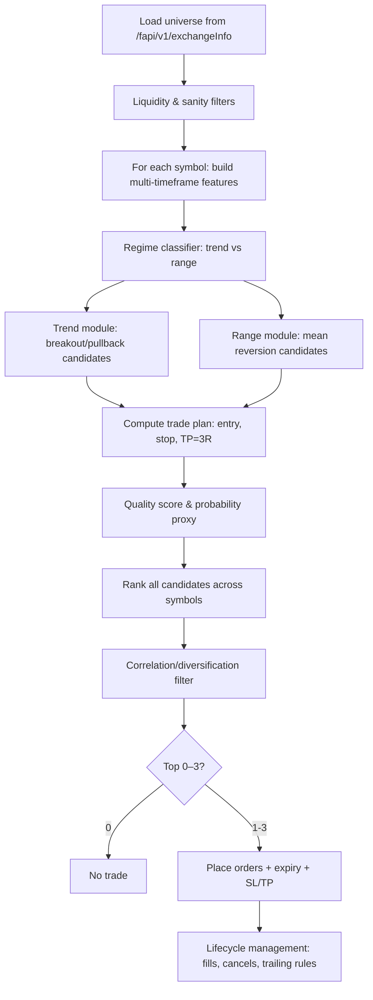
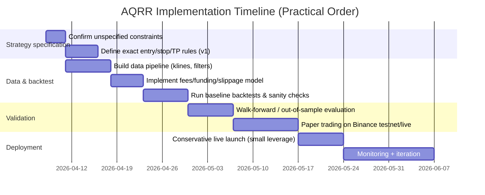

# Binance USDⓈ-M Futures Strategy Selection Report

*Generated on 2026-04-08 (Asia/Baku). Preferred language: en-GB.*

*Deliverable file (same content):* [Download `Binance_USDM_Futures_Strategy_Report.md`](sandbox:/mnt/data/Binance_USDM_Futures_Strategy_Report.md)

## Executive summary

This report reverse-engineers *all* explicit and implicit strategy requirements from your provided requirements brief and then evaluates major trading strategy families against those constraints, with a specific focus on what is realistically executable on **Binance USDⓈ-M (USDT‑margined) perpetual futures** using a **very small account (10 USD)**. fileciteturn0file0

Your requirements are unusually clear about *behaviour* (quality- and execution‑first, no forced trades, full automation, broad market scanning, ranking, and strict “minimum 1:3 R:R”) but still leave some key quantitative constraints **unspecified** (notably: preferred time horizon, maximum acceptable drawdown, and per‑trade risk budget). fileciteturn0file0

Across the strategy universe, the strongest fit is a **regime-adaptive, multi-factor “quality-ranked setups” engine** that:
- scans many USDⓈ-M symbols,
- generates a small set of *candidate* setups for both long and short,
- rejects trades under poor liquidity / abnormal spread / volatility shocks,
- computes a probability/quality score for each candidate,
- applies a correlation/diversification filter,
- and finally executes **0–3** trades (never forcing the count), each structured with a **planned** minimum **1:3 risk-to-reward**. fileciteturn0file0

A practical shortlist (top matches) is:

**Top pick: Adaptive Quality‑Ranked Regime Strategy (AQRR)**  
A hybrid engine with *two modules* (trend-continuation and range mean-reversion), selected per symbol via a regime filter, then ranked cross-sectionally to pick the best 0–3 setups. It best matches your “adaptive, realistic trader standard, no forced trades, top‑3 selection” philosophy. fileciteturn0file0

**Strong alternative: Pure Time‑Series Momentum / Trend Following (TSM) with strict trade quality filters**  
Simpler, research-supported (trend/time-series momentum is widely documented in futures markets) and naturally compatible with long/short, broad scanning and selective entry—though it is less “style-flexible” unless you add optional pullback/breakout entry variants. citeturn0search3turn0search7turn0search19

**Situational module (optional): Range Mean Reversion with enforced 3R feasibility**  
Can satisfy your 1:3 rule only when ranges are wide enough *or* stops are structurally tight; otherwise it should skip trades. It works best as a *secondary module* inside AQRR rather than a stand-alone “always mean reversion” bot. citeturn3search2turn3search3

Key exchange realities that materially shape the design:
- **Minimum order notional for USDⓈ-M futures is enforced at a threshold (historically 1 USD)**; Binance may change thresholds and advises checking via API/contract specs. citeturn5view0  
- **Fees matter disproportionately with leverage**; Binance explains maker vs taker, and provides example rates (regular maker 0.02%, taker 0.05%) and commission formulae. citeturn7view0  
- Perpetual futures **mark price** and **funding** mechanics affect PnL, liquidation risk, and holding cost; Binance provides detailed definitions and supports programmatic access (e.g., /fapi/v1/premiumIndex, /fapi/v1/fundingRate). citeturn8search8turn4search24turn4search2

Recommended next steps (high impact):
1) lock down missing constraints (time horizon, max leverage cap, max drawdown / daily loss limit, and whether “1:3” means *initial TP only* or *no early exit before 3R*), because they strongly determine the final rules;  
2) implement the AQRR engine **first in backtest**, then in paper trading, then live with conservative leverage and strict liquidity filters;  
3) build a realistic backtesting harness that includes Binance fees, funding, notional/tick/step filters, and conservative slippage modelling to avoid strategy illusion. citeturn7view0turn4search0turn4search2turn1search3

## Requirements extracted from the provided MD brief

### Explicit requirements

The following requirements are stated directly in the brief and should be treated as **hard constraints** unless you later amend them. fileciteturn0file0

| Area | Requirement (explicit) | Notes |
|---|---|---|
| Venue & product | Strategy must trade **Binance Futures USD‑M (USDⓈ‑M)** | The document is explicitly scoped to USD‑M futures, not spot, COIN‑M, or options. fileciteturn0file0 |
| Market coverage | Scan a **very large portion** of the USD‑M market, “as many relevant coins as reasonably possible” | Must *not* be limited to a hard-coded small set (e.g., “300”). fileciteturn0file0 |
| Direction | Must support **long and short** | The bot is free to choose direction per setup. fileciteturn0file0 |
| Core objective | Identify only the **best tradable opportunities**, prioritising quality over quantity | Must avoid forced trades and unrealistic “perfect textbook” filtering. fileciteturn0file0 |
| Adaptiveness | Strategy must be **adaptive**, not one rigid style (not only breakout/pullback/trend/mean reversion) | Flexibility is required in setup style, entry, timeframes, SL/TP style, filtering, leverage, order expiry, and position management. fileciteturn0file0 |
| Automation | Fully automated: after user starts the bot, it handles scanning, ranking, orders, cancellations, position management, SL/TP, etc. | You explicitly require an end-to-end autonomous trade lifecycle. fileciteturn0file0 |
| Opportunity limit | At each scan cycle select **up to 3 setups maximum**, but may choose 0, 1, or 2 | “Prefer no trade over bad trade.” fileciteturn0file0 |
| Ranking priority | When multiple exist, rank and prioritise the **top 3** by **highest probability of success / chance of winning** | Ranking should reflect quality/structure/execution viability, not just volatility/activity. fileciteturn0file0 |
| Trade frequency | Trade frequency is **not** a target; only trade quality matters | Low or high count acceptable. fileciteturn0file0 |
| Risk/reward | Every executed trade must preserve **minimum R:R = 1:3** (hard rule) | Higher is allowed; lower is forbidden. fileciteturn0file0 |
| Capital | Account budget is **10 USD** | Must be realistic for small-account constraints. fileciteturn0file0 |
| Allocation | If multiple trades are active, capital allocation must be **equal / evenly distributed** | Balanced exposure across active trades is required “in normal operation.” fileciteturn0file0 |
| Concurrency | Maximum **3 pending orders** and **3 open positions** | This caps both idea generation and risk aggregation. fileciteturn0file0 |
| Order entry | Pending order type is flexible (limit, stop, breakout, retest…) | Strategy chooses most suitable entry form per setup. fileciteturn0file0 |
| Pending order expiry | Each pending order must have **expiry logic**; cancel when stale | Validity period is strategy-defined and dynamic. fileciteturn0file0 |
| Re-entry | Re-entry on same coin is allowed later if a fresh valid setup appears | No permanent “ban list” per symbol. fileciteturn0file0 |
| Position management | No forced fixed time limit for positions; hold as long as logically valid | Strategy must manage positions automatically end-to-end. fileciteturn0file0 |
| SL/TP method | Stop-loss & take-profit methods are **not pre-fixed**, but must remain consistent with 1:3 R:R and realistic execution | Adaptiveness is encouraged, but consistency required. fileciteturn0file0 |
| Correlation control | Avoid taking 3 positions that are essentially the same exposure (high correlation / same theme / near-identical setups) | Must maintain reasonable diversification across active selections. fileciteturn0file0 |
| Market condition filtering | Filter out conditions that materially reduce reliability: extreme volatility, pump/dump, abnormal spreads, poor liquidity, unstable execution | Must be “execution-aware.” fileciteturn0file0 |
| Exchange reality | Must account for Binance constraints (min notional, fees, slippage, leverage limits) | Binance explicitly documents fees and notional constraints; the strategy must incorporate them. citeturn5view0turn7view0 |
| Leverage | Leverage must be selected automatically; not hard-coded | Must remain realistic & compatible with Binance rules and “trade safety.” fileciteturn0file0 |
| “Realistic quality threshold” | Must reject noise but avoid impossible strictness (should not become “almost never trades”) | Key “human trader realism” requirement. fileciteturn0file0 |
| “Strategy intelligence” | “Deep analysis” means intelligent evaluation and multi-factor quality improvement—not just many indicators | Suggests structure/trend/momentum/vol/volume/liquidity context and multi-factor ranking. fileciteturn0file0 |

### Implicit requirements and design implications

The brief implies additional constraints that are not written as “must” statements but are necessary for the desired behaviour.

A broad-scan, multi-symbol bot that ranks opportunities implies **strict attention to exchange API limits and data weights**, because Binance rate limits and request weights differ across endpoints and can trigger HTTP 429 if violated. citeturn4search8turn4search0turn4search1  
This matters because a “large universe scan” becomes a throughput problem: the strategy must be selective about which data it pulls at what frequency (e.g., use cached / streaming klines and only pull deeper data such as order book snapshots for shortlisted candidates).

Because Binance can adjust trading parameters (tick size, minimum trade amount, etc.) and advises users to query via API, the bot must treat contract filters as **dynamic configuration**, not hard-coded constants. citeturn5view0turn4search0turn0search23turn0search27

Because your account is small (10 USD), the strategy must favour:
- **lower fee impact** (more maker-style entries when feasible), and
- **high liquidity / low spread** instruments to avoid slippage dominating edge. citeturn7view0turn0search12  
(These are *economic* implications: on a tiny account, a small absolute cost is a large percentage of equity.)

### Unspecified or ambiguous constraints

The brief intentionally leaves multiple items flexible. For strategy selection, these should be marked **unspecified** until you decide them (or until you provide additional constraints). fileciteturn0file0

| Constraint | Status | Why it matters to strategy choice |
|---|---|---|
| Preferred time horizon (scalping vs intraday vs swing) | **Unspecified** | Determines signal timeframes (1m vs 15m/1h), fee sensitivity, and whether funding is material. citeturn4search1turn4search2turn8search16 |
| Risk tolerance / maximum drawdown | **Unspecified** | Determines position sizing, leverage caps, circuit breakers, and acceptable strategy volatility. |
| Target risk per trade (e.g., 0.5% / 1% of equity) | **Unspecified** | Needed to compute position size and leverage consistently. |
| Maximum leverage cap (hard limit) | **Unspecified** | “Leverage is adaptive” is required, but without a cap you risk over-leverage on small accounts. fileciteturn0file0 |
| Margin mode (isolated vs cross) and position mode (one-way vs hedge) | **Unspecified** | Impacts risk containment and how long/short is represented at account level. citeturn4search3turn4search22 |
| Execution preference (maker vs taker bias) | **Unspecified** | Fees differ materially; on small accounts, maker bias can be a requirement in practice. citeturn7view0 |
| Universe exclusions (blacklist / whitelist) | **Unspecified** | You want broad scan, but illiquid/peripheral contracts can create execution risk. fileciteturn0file0 |
| Allowed hold duration across funding timestamps | **Unspecified** | Perpetual funding can be a cost or a yield; holding through funding windows changes expected value. citeturn8search16turn4search2turn8search19 |
| Tax / jurisdiction constraints | **Unspecified** | Not in scope unless you add it. |

## Strategy landscape and research survey

This section reviews major strategy archetypes and evaluates them along the dimensions you requested: objective, horizon, instruments, entry/exit logic, risk profile, capital/liquidity needs, transaction-cost sensitivity, data needs, backtesting concerns, and common performance metrics.

### Perpetual futures realities that affect *all* strategies here

Binance USDⓈ‑M perpetual futures differ from spot in ways that directly affect strategy design and backtesting:
- **Commission** depends on *position value × fee rate*, with different maker/taker costs; Binance provides both definitions and example rate levels. citeturn7view0  
- **Minimum order notional** is enforced; Binance has historically set the threshold at **$1 notional** for USDⓈ‑M orders and warns that the threshold may change. citeturn5view0  
- **Mark price, index price, and funding** are integral to liquidation and holding costs; Binance documents that mark price incorporates multiple inputs (including order book best bid/ask series, funding, and a composite spot index). citeturn8search8turn8search0turn4search24  
- **Funding rate** is linked to premium/interest components and is applied periodically (often in 8‑hour intervals; some contracts vary). Binance publishes a specific FAQ for its funding calculation and provides API endpoints for funding history. citeturn8search16turn4search2turn4search6  
- Liquidation/insurance fund/ADL mechanisms create *tail risks* that are not captured if you backtest “stop-loss executes perfectly at last price”. Binance documents liquidation protocols, insurance fund role, and ADL. citeturn8search3turn8search17turn8search14

### Trend following and time-series momentum

| Dimension | Notes |
|---|---|
| Objective | Capture persistent directional moves (“trends”) by being long when price trends up and short when it trends down. In academic finance, a closely related concept is **time-series momentum** in futures. citeturn0search7turn0search3 |
| Typical horizon | Intraday to multi‑month depending on signal design; classic futures studies often use 1–12 month lookbacks with ~1 month holding periods, but the concept generalises. citeturn0search7turn0search19 |
| Instruments | Works naturally on **futures** (including crypto perpetual futures), because long/short is symmetric and leverage is available. citeturn0search7turn8search1 |
| Typical signals | Moving average filters, breakouts (e.g., Donchian channels), slope/trend strength, volatility scaling. (Implementation details vary; the key is systematic direction based on past returns.) citeturn0search7 |
| Risk profile | Often **positively skewed** return profile: many small losses, fewer large winners; can suffer drawdowns in choppy markets. (This is a stylised profile; actual depends on implementation.) citeturn0search7 |
| Capital & liquidity | Can run on small accounts *if* minimum order notional and contract filters allow; best on liquid contracts to reduce slippage. citeturn5view0turn0search12 |
| Cost sensitivity | Medium: trend strategies can be robust if holding periods are not too short, but frequent entries/exits or over-trading will make fees dominate, especially on small equity. citeturn7view0 |
| Data needs | OHLCV candles are often sufficient; optional: funding/mark price for futures realism. citeturn4search1turn4search2turn4search24 |
| Backtesting notes | Must model: maker/taker fees, realistic fills for breakouts, and avoidance of look-ahead bias; parameter search can overfit. citeturn7view0turn1search3 |
| Common performance metrics | Sharpe/Sortino, max drawdown, win rate, profit factor, average R multiple; Sharpe ratio definitions are discussed by Sharpe and in his later note. citeturn3search4turn3search13 |

Why it often fits your brief: trend/time-series momentum naturally supports long/short, is compatible with cross-sectional ranking (“top opportunities”), can be selective, and can be structured to enforce 3R minimum (e.g., via ATR/swing stops with fixed-multiple target). The primary trade-off is that pure trend is not always “adaptive” unless you add regime filters or alternative modules. citeturn0search7turn0search3turn0search19

### Cross-sectional momentum

| Dimension | Notes |
|---|---|
| Objective | Hold “winners” and short “losers” based on relative performance over a lookback window; the momentum effect in equities is classically documented by Jegadeesh & Titman (1993). citeturn1search0 |
| Typical horizon | Often 3–12 months in the original equity context, but variants exist from intraday to weekly. citeturn1search12 |
| Instruments | Can be implemented on futures (including crypto perpetuals) by ranking symbols and taking long/short positions. |
| Typical signals | Rank by trailing returns (possibly volatility-adjusted), then long top quantile and short bottom quantile; optionally add trend/quality filters. citeturn1search0 |
| Risk profile | Risk of momentum crashes/regime shifts; diversification is important because single-name momentum can be noisy. |
| Capital & liquidity | Requires trading multiple names (in a textbook form). With your **max 3 positions**, it becomes a “top‑3 winners/losers” miniature portfolio. fileciteturn0file0 |
| Cost sensitivity | Medium to high if rebalanced frequently; ranking-based strategies can accidentally increase turnover. citeturn7view0 |
| Data needs | OHLCV generally sufficient; may require cross-asset data standardisation and survivorship handling. |
| Backtesting notes | Cross-sectional backtests are vulnerable to multiple testing and selection bias; strong guardrails are recommended. citeturn1search3turn1search7 |
| Common metrics | Same as trend: Sharpe/Sortino/MDD; additionally turnover and capacity. citeturn3search4turn3search13 |

Fit to your brief: great for *ranking and selecting “top 3”*, but if implemented naively it may feel like “forced trades” (because it always produces top ranks). To comply with your “no trade is acceptable” principle, cross-sectional momentum must be gated by *absolute* quality thresholds (liquidity, volatility, structure) so that it can output zero trades. fileciteturn0file0

### Mean reversion and contrarian trading

| Dimension | Notes |
|---|---|
| Objective | Profit from prices reverting toward a mean/value after an overshoot; contrarian effects and mean reversion are documented in multiple academic settings (e.g., De Bondt & Thaler on overreaction; Poterba & Summers on mean reversion evidence). citeturn3search2turn3search3 |
| Typical horizon | Often short-term (minutes-days) for microstructure-driven reversion; can also be multi-year in long-horizon “valuation” mean reversion (not relevant to your bot). citeturn3search3 |
| Instruments | Works on futures; also common in statistical arbitrage variants. |
| Typical signals | Bollinger Bands/z-scores, RSI extremes, VWAP deviation, order-flow imbalance; regime filters (range vs trend) are commonly needed to avoid “catching knives”. |
| Risk profile | Tail risk during breakouts/trend transitions; can generate many small wins and occasional large losses if stops fail or gaps occur. |
| Capital & liquidity | Can operate with small capital but often relies on frequent small edges; fees/spread can dominate on tiny accounts unless trades are selective. citeturn7view0 |
| Cost sensitivity | Often high because many implementations are high turnover. citeturn7view0 |
| Data needs | Can use OHLCV; higher-frequency variants benefit from order book / trade prints. |
| Backtesting notes | Needs careful modelling of fills (mean reversion signals often trigger around volatility/spread spikes), and realistic stop execution. |
| Common metrics | Win rate, average win/loss, skewness, drawdown, and downside risk measures (Sortino is often informative for negatively skewed strategies). citeturn3search13turn3search5 |

Fit to your brief: mean reversion can be made selective and “real-trader-like” with strong filters, but **your minimum 1:3 R:R** constraint is *harder* to satisfy in pure mean reversion because many reversion moves are modest; the bot must therefore **skip** trades when the range structure cannot support 3R. fileciteturn0file0

### Pairs trading

| Dimension | Notes |
|---|---|
| Objective | Trade relative mispricing between two related assets (a “pair”) expecting convergence; Gatev, Goetzmann & Rouwenhorst (2006) provide a classic empirical study of a pairs trading rule. citeturn1search1turn1search13 |
| Typical horizon | Days to weeks in classical equity implementations; can be shorter with high-frequency data. citeturn1search1 |
| Instruments | Requires **two legs** (long one, short the other). On futures this is feasible but doubles order/fee complexity. |
| Typical signals | Pair selection based on historical similarity; entry when spread/z-score diverges; exit on convergence or stop. citeturn1search1 |
| Risk profile | Model breakdown risk (relationship changes), correlated liquidation risk if both legs move adversely, execution risk on both legs. |
| Capital & liquidity | With only **3 open positions max**, “one pairs trade” already consumes two slots (two legs), limiting diversification. fileciteturn0file0 |
| Cost sensitivity | Medium to high due to two legs and potentially frequent re-entries. citeturn7view0 |
| Data needs | Historical price series for pair formation; potentially cointegration testing; stable data is critical. |
| Backtesting notes | Must include two-leg execution assumptions and funding/carry on both sides. citeturn4search2turn8search16 |
| Common metrics | Spread PnL, correlation stability, drawdown, trade duration, slippage. |

Fit to your brief: pairs trading is *not* an obvious fit for your “top 3 best setups” because it typically implies running a book of many pairs; with your strict concurrency and very small capital, it is likely too complex and fee-sensitive unless used very selectively (e.g., one pair only in exceptional conditions). fileciteturn0file0

### Statistical arbitrage

| Dimension | Notes |
|---|---|
| Objective | Market-neutral or low-beta alpha derived from statistical structure (e.g., mean reversion in residuals). Avellaneda & Lee discuss model-driven statistical arbitrage and present backtests in US equities. citeturn2search2turn2search6 |
| Typical horizon | Often intraday to multi-day depending on signal; many strategies assume frequent rebalancing. |
| Instruments | Typically equities/ETFs/futures; in crypto, can be adapted but regime instability is higher. |
| Typical signals | PCA residual mean reversion, factor-neutral spreads, z-score entry/exit; often portfolio-level risk controls. citeturn2search2turn2search10 |
| Risk profile | Tail risk when correlations break; drawdowns during regime shifts; execution risk across many names. |
| Capital & liquidity | Classic stat arb is capacity-hungry and tends to need many positions; with 3 positions max, you can only implement a very small fragment. fileciteturn0file0 |
| Cost sensitivity | High for high-turnover implementations. citeturn7view0 |
| Data needs | Reliable multi-asset historical data; sometimes needs corporate actions in equities (not relevant here). |
| Backtesting notes | Extremely prone to overfitting if you tune many parameters across many assets; literature on backtest overfitting is directly relevant. citeturn1search3turn1search7 |
| Common metrics | Sharpe/Sortino, MDD, turnover, exposure neutrality, tail risk. citeturn3search4turn3search13 |

Fit: Partial fit at best. Your goal is not explicitly market-neutral; you want long/short directional freedom, *but with correlation control*. A full stat-arb book is not realistic under your small capital and strict concurrency.

### Market making

| Dimension | Notes |
|---|---|
| Objective | Earn the bid–ask spread by providing liquidity (posting limit orders), while managing inventory and adverse selection risk. This is a classic microstructure problem; Avellaneda & Stoikov model optimal market making in a limit order book. citeturn1search2turn1search18 |
| Typical horizon | Seconds to minutes; frequent quoting and re-quoting. citeturn1search2 |
| Instruments | Works on order-book markets (including crypto futures). |
| Typical signals | Order book imbalance, volatility/arrival-rate models, inventory controls; continuous quote updates. citeturn1search2 |
| Risk profile | Adverse selection (getting “run over”), inventory accumulation in trends, tail risk in volatility spikes. |
| Capital & liquidity | Works best where liquidity is deep and spreads are stable; small accounts are vulnerable to fees and inventory swings. citeturn7view0 |
| Cost sensitivity | Very high (lots of fills). Even maker fees can add up; taker hedges are expensive. citeturn7view0 |
| Data needs | High-frequency order book data and low-latency execution. |
| Backtesting notes | Very hard to backtest without level-2 data and realistic queue position modelling. citeturn1search2turn1search6 |
| Common metrics | Realised spread, inventory variance, fill rate, queue position, latency metrics. |

Fit: poor. Your brief explicitly rejects trading “constantly just to create activity” and targets a few high-quality setups; market making is structurally a high-turnover strategy. fileciteturn0file0

### Algorithmic high-frequency trading

HFT is not a single strategy so much as a **latency/market-microstructure operating regime** (often market making, arbitrage, or ultra-short-horizon prediction). Models like Avellaneda–Stoikov assume order book dynamics and rapid quote updates, which are difficult to match from a typical retail cloud deployment. citeturn1search2turn4search15  
Fit is poor under your “select 0–3 best opportunities” requirement, and the backtesting burden is heavy.

### Options strategies

Options strategies (spreads, straddles, volatility selling, hedged structures) are a major category, but they are not directly aligned with your stated venue (USD‑M futures only). fileciteturn0file0  

Even so, for completeness:
- Options pricing and risk is classically grounded in Black–Scholes. citeturn6search2  
- Standardised options risk disclosures emphasise the complexity and risk profile of options. citeturn6search20turn6search0  
- Binance itself documents options mark price and greeks in its API (separate from futures APIs). citeturn6search3turn6search11  

Fit: mostly out of scope unless you later expand the scope to include Binance Options.

### Carry trades

| Dimension | Notes |
|---|---|
| Objective | Earn a yield/interest differential (classic FX carry) or, in perpetual futures, earn/avoid funding by holding positions that receive positive funding. |
| Typical horizon | Often multi-day to months; carry is a holding strategy. citeturn2search3turn2search15 |
| Instruments | FX; in crypto, often spot+perp basis trades, or directional funding capture. Binance provides funding parameters and history via API. citeturn8search16turn4search2turn8search27 |
| Risk profile | Carry is exposed to **crash risk**; “carry trades and currency crashes” documents negative skew/crash risk in FX carry. citeturn2search3turn2search7 |
| Capital & liquidity | Often requires meaningful capital to withstand drawdowns and funding changes; basis trades need multiple legs. |
| Cost sensitivity | Medium; entry/exit costs plus ongoing funding. |
| Data needs | Funding/basis data, settlement schedules, risk controls. |
| Backtesting notes | Must include funding and basis dynamics to be meaningful. citeturn4search2turn8search16 |
| Common metrics | Funding PnL, drawdown, crash exposure, tail risk. |

Fit: partial. Carry/basis trades are not “setup-based” and often need two legs; also your hard 1:3 R:R rule is not a natural match to carry economics, which tends to produce small returns with tail risk. fileciteturn0file0

### Portfolio optimisation

Modern portfolio theory starts with Markowitz’s mean–variance portfolio selection, and later work (e.g., Black–Litterman) addresses unstable optimiser behaviour by combining market equilibrium with subjective views. citeturn2search0turn2search1turn2search21  

Fit: portfolio optimisation is relevant to **selection and diversification** logic, but your brief hard-codes “equal allocation across active trades” and a maximum of 3 positions, which limits what optimisation can do. fileciteturn0file0  
Still, clustering/correlation control is very much aligned with portfolio thinking.

### Machine-learning-based strategies

ML can be used either to:
- forecast returns/volatility, or
- more conservatively, to improve *ranking and filtering* (probability-of-success scoring) without leaning on brittle point forecasts.

However, ML trading is highly vulnerable to **backtest overfitting**, especially when many models/parameters are tried across many assets; Bailey et al. formalise why conventional holdout can be unreliable in investment backtests. citeturn1search7turn1search3  

Fit: ML is best used as a **secondary tool** in your context (for ranking and regime classification) rather than as a fully predictive black box.

## Strategy-to-requirements mapping

This table maps strategy families to your extracted requirements. Scores are qualitative:

- **✓** = naturally fits / low friction  
- **△** = can be adapted, but has material trade-offs  
- **✗** = conflicts with a hard requirement or is impractical under constraints

Key requirement shorthand:
- **Venue**: Binance USD‑M futures  
- **0–3 trades**: outputs few trades without forcing  
- **1:3 R:R**: can naturally enforce planned 3R structure  
- **10 USD**: viable given min notional + fees  
- **Adaptive**: not locked to one style  
- **Correlation control**: works with diversification constraint  
- **Automation**: can be implemented end‑to‑end with realistic execution logic

| Strategy family | Venue fit | 0–3 trades & “no forced trade” | 1:3 R:R compatibility | 10 USD viability | Adaptive requirement | Correlation control | Cost & liquidity sensitivity | Overall fit to your brief |
|---|---:|---:|---:|---:|---:|---:|---:|---:|
| Trend following / time-series momentum | ✓ | ✓ | ✓ | △ | △ | ✓ | △ | **High** |
| Cross-sectional momentum | ✓ | △ | △ | △ | △ | △ | △ | Medium–High |
| Mean reversion / contrarian | ✓ | △ | △ | △ | △ | △ | ✗ (often high turnover) | Medium |
| Pairs trading | ✓ | △ | △ | ✗ | ✗ | ✓ (hedged) | ✗ | Low–Medium |
| Statistical arbitrage (multi-asset) | ✓ | ✗ | △ | ✗ | △ | ✓ | ✗ | Low |
| Market making | ✓ | ✗ | ✗ | ✗ | ✗ | △ | ✗ | Low |
| HFT (general) | ✓ | ✗ | ✗ | ✗ | ✗ | △ | ✗ | Low |
| Options strategies | △ (out of scope) | △ | △ | △ | ✓ | ✓ | △ | Low (scope mismatch) |
| Carry / funding capture | ✓ | ✓ | ✗ | △ | △ | ✓ | △ | Low–Medium |
| Portfolio optimisation (as selection overlay) | ✓ | ✓ | ✓ | ✓ | ✓ | ✓ | ✓ | Medium (as overlay) |
| ML-based prediction / ranking | ✓ | ✓ | ✓ | ✓ | ✓ | ✓ | △ | Medium–High (as ranking tool) |

Notes on the most important mismatches:
- **Market making / HFT** conflicts with your “quality over quantity” and “not trading constantly” requirements and is highly cost/latency sensitive. citeturn1search2turn7view0turn4search15  
- **Carry** does not naturally map to a strict 3R planned payoff; its expected return is typically “small carry, occasional crash”. citeturn2search3turn2search7  
- **Pairs/stat‑arb** are much harder to do under a 3‑position cap and very small equity because they tend to need multiple legs and/or many concurrent positions. citeturn1search1turn2search2

## Recommended strategy designs

The following sections are written in “implementation-ready” Markdown with rules/pseudocode, parameter suggestions, risk management, backtest design, and an implementation checklist. These designs are intentionally conservative about trading frequency and execution realism to align with your brief. fileciteturn0file0

### Adaptive Quality‑Ranked Regime Strategy

#### Rationale for fit

AQRR is designed specifically to satisfy your combination of constraints:
- It is **adaptive** by construction (it can select between a trend module and a range module depending on detected regime rather than hard-coding one style). fileciteturn0file0  
- It produces **0–3** trades per cycle and can choose **no trade** if quality thresholds are not met, matching your “no forced trades” priority. fileciteturn0file0  
- Its engine is inherently a **ranking system**: candidates are scored for probability/quality and only the best few survive. fileciteturn0file0  
- It can enforce a planned **≥ 3R** structure by only accepting trades where the technical structure allows a stop and a 3R target that is still plausible before a key invalidation level. fileciteturn0file0  
- It supports your **correlation control** requirement by applying a diversification filter after ranking. fileciteturn0file0

#### Strategy overview

**Universe:** all active Binance USDⓈ‑M perpetual futures symbols that pass liquidity filters (queried from exchange info and tickers). citeturn4search0turn0search8  

**Timeframes (suggested default, adjustable):**
- Signal timeframe: **15m** (entries)  
- Context timeframe: **1h** (regime/trend context)  
- Higher context (optional): **4h** (major trend filter)

These are defaults because they offer a balance between fee sensitivity (worse on very short horizons) and “setup realism”. The final choice is unspecified in your brief and should be confirmed. fileciteturn0file0

#### Workflow diagram



(Endpoints shown are indicative; Binance provides /fapi/v1/exchangeInfo for trading rules & symbols, and trade endpoints for orders.) citeturn4search0turn4search3turn4search27

#### Detailed rule set

##### Universe and liquidity filters

Hard requirement: broad scan, but must remain realistic for execution quality. fileciteturn0file0  

Recommended filters (tuneable):
- Contract must be active and tradeable (from **/fapi/v1/exchangeInfo**). citeturn4search0  
- Exclude symbols with:
  - large relative spread (e.g., best bid/ask spread / mid > 0.10%)  
  - insufficient 24h quote volume (set threshold by experimentation; for small accounts, consider “top liquidity tier” first and expand cautiously)  
- Exclude symbols with frequent parameter changes/delist risk if your system cannot adapt quickly (Binance exposes delist schedule behaviour via exchangeInfo updates). citeturn4search19  

##### Market condition filters

These implement your “avoid dangerous conditions” requirement. fileciteturn0file0  

Suggested filters:
- Volatility shock filter: if current ATR% (15m) is above a percentile threshold vs last N days, skip (avoids pump/dump regimes).  
- Spread anomaly filter: if spread is > X times its 7‑day median, skip (execution degraded).  
- Funding sanity filter: avoid entering positions just before funding if funding is extreme and would undermine expectancy; funding/interest mechanics are defined in Binance funding docs and accessible via API. citeturn8search16turn4search2turn4search24  

##### Regime classifier

This decides whether a symbol should be evaluated using trend-continuation logic or range mean-reversion logic, supporting your “adaptive style” requirement. fileciteturn0file0  

Simple (transparent) classifier:
- Compute ADX(14) on 1h candles (or alternative trend-strength metric).
- If ADX >= 20 → **trend regime**  
- If ADX <= 15 → **range regime**  
- Else → regime uncertain; allow only higher-quality trend trades (stricter thresholds) or skip.

(ADX is a common heuristic; you can replace it later with a more sophisticated classifier, but keep the initial version interpretable to reduce overfitting risk. citeturn1search3turn1search7)

##### Trend module

Generate **two** candidate types per direction (long and short):

**Trend-breakout candidate (long):**
- Context trend filter: price above a slow MA on 1h (e.g., EMA200) AND 1h momentum positive.
- Setup: 15m close breaks above recent resistance (e.g., 20‑bar high).
- Entry plan: prefer **limit on retest** of breakout level (reduces slippage; more maker-like). If no retest within expiry, cancel.
- Stop: below breakout structure (e.g., below last swing low or below breakout level minus buffer).
- Take profit: TP = entry + 3*(entry − stop).

**Trend-breakout candidate (short):** symmetric.

**Trend-pullback candidate (long):**
- Context trend filter as above.
- Setup: pullback to fast MA zone (e.g., EMA20/EMA50 on 15m) with rejection (e.g., bullish engulf / close back above EMA20).
- Entry: limit near pullback zone.
- Stop: below pullback swing low.
- TP: ≥ 3R.

##### Range module

Only create a range candidate if the structure supports 3R:

**Range mean-reversion candidate (long):**
- Regime: range.
- Setup: price touches/penetrates lower volatility band or local range support, with momentum exhaustion (e.g., RSI low) and stabilising candle close.
- Entry: limit near support.
- Stop: below support (tight, structural).
- Feasibility gate: estimated distance to mean/upper range must be ≥ 3× stop distance; otherwise reject the candidate (cannot meet 3R realistically).

**Range mean-reversion candidate (short):** symmetric.

##### Candidate scoring and ranking

Hard requirement: rank by **highest chance of winning / success probability**, not just volatility. fileciteturn0file0  

A transparent multi-factor score (no ML training required initially):
- Trend strength score (trend module only)
- Momentum confirmation score
- Volume/liquidity score (penalise thin books)
- Volatility stability score (penalise shock conditions)
- Structure quality score (clean breakout level or range boundaries)
- Cost penalty (expected fees + slippage; maker entries get a smaller penalty than taker)

The output is a single score in [0, 100]. Select candidates that exceed a minimum threshold (e.g., > 70) to enforce your “realistic quality threshold”. fileciteturn0file0

##### Correlation control and selection of top trades

Hard requirement: avoid three positions that replicate the same exposure. fileciteturn0file0  

Operational approach:
1) Sort candidates by score descending.
2) Iteratively add the best candidate that does **not** breach a correlation threshold with already-selected trades, measured on recent returns (e.g., 1h returns over last 3–7 days).
3) Stop when selected count == 3 or no acceptable candidates remain.

This implements diversification in the spirit of modern portfolio theory (diversification to reduce concentration). citeturn2search0

#### Pseudocode

```pseudo
INPUTS:
  equity_usd = current account equity
  max_positions = 3
  min_rr = 3.0
  per_trade_risk_pct = UNSPECIFIED (recommend 0.5%–1.5% for small account; confirm)
  timeframes = {signal: 15m, context: 1h, higher: 4h}

LOOP every scan_interval (e.g., every 1–5 minutes):
  universe = GET /fapi/v1/exchangeInfo symbols where status=TRADING
  candidates = []

  FOR symbol in universe:
    if fails_liquidity_filters(symbol): continue
    features = compute_features(symbol, timeframes)

    if fails_market_condition_filters(features): continue

    regime = classify_regime(features)

    if regime == TREND:
      cand_list = generate_trend_candidates(symbol, features, min_rr)
    else if regime == RANGE:
      cand_list = generate_range_candidates(symbol, features, min_rr)
    else:
      cand_list = generate_only_highest_quality_trend_candidates(symbol, features, min_rr)

    FOR cand in cand_list:
      cand.cost_est = estimate_costs(cand)   # fee + slippage proxy
      cand.score = quality_score(cand, features) - cost_penalty(cand.cost_est)
      if cand.score >= quality_threshold:
         candidates.append(cand)

  ranked = sort_desc(candidates, key=score)

  selected = []
  FOR cand in ranked:
    if len(selected) == max_positions: break
    if correlation_ok(cand, selected): selected.append(cand)

  # Execute (do not force trade count)
  if len(selected) == 0:
    continue

  risk_budget_total = equity_usd * per_trade_risk_pct
  risk_per_trade = risk_budget_total / len(selected)  # equal risk allocation

  FOR cand in selected:
    position_size = risk_per_trade / (abs(entry - stop))
    leverage = choose_leverage(symbol, position_size, equity_usd)
    place_entry_and_brackets(cand, position_size, leverage)
    set_order_expiry(cand)
```

#### Parameter choices and defaults

Because your brief leaves the timeframe and risk tolerance unspecified, the numbers below are **starter defaults**, not final truth. fileciteturn0file0  

Recommended initial settings for testing:
- Signal TF: 15m; Context TF: 1h; Higher TF: 4h.  
- Scan interval: 60–120 seconds (fast enough to react, not so fast you chase noise).  
- Max positions: 3 (hard requirement). fileciteturn0file0  
- Order expiry: 3–6 signal candles (45–90 minutes) for pullback/retest limit orders; shorter for breakouts.  
- Quality threshold: start at 70/100 and tune to achieve “not too strict, not too loose”. fileciteturn0file0  
- Correlation limit: e.g., |ρ| < 0.70 on 1h returns (tuneable).

#### Risk management

Your brief mandates equal allocation/exposure across active trades and a minimum planned 3R structure. fileciteturn0file0  

Risk management proposal (to be confirmed where unspecified):

**Position sizing**
- Prefer **risk-based sizing** (equalise $ risk per trade) rather than equal notional sizing.
- With N selected trades (1–3), risk per trade = (equity × risk_pct) / N.
- Position quantity is derived so that loss at stop ≈ risk_per_trade.

Because Binance enforces symbol step sizes and lot sizes, the computed quantity must be rounded to valid increments using exchange filters. citeturn0search12turn4search0  

**Leverage selection**
- Leverage is not fixed (your requirement). fileciteturn0file0  
- Select leverage to satisfy three conditions:
  1) Position notional meets minimum notional and valid quantity/tick filters. citeturn5view0turn0search12  
  2) Liquidation buffer: estimated liquidation price should be meaningfully beyond stop (e.g., stop is at least 2× further from entry than liquidation, or vice versa depending on direction). This reduces “liquidated before stop” risk (not guaranteed). citeturn8search3turn8search18turn0search0  
  3) Fee sensitivity: avoid extreme leverage, because fee impact scales with notional; Binance’s commission formula is explicitly based on position value. citeturn7view0  

**Stop-loss**
- Use structural stops (swing points / breakout invalidation) plus a volatility buffer.
- Do **not** widen stops to “avoid being stopped out” if that would make 3R TP unrealistic; instead, reject the setup.

**Take-profit**
- Place an initial TP at **3R** (hard requirement) and avoid trailing/partial exits *before* 3R unless you explicitly redefine what “preserve minimum 1:3” means in practice. fileciteturn0file0  
- Optional after reaching 3R: trail stop to capture extended trends, but ensure it does not systematically reduce realised R below the intended minimum without your approval.

**Circuit breakers (recommended)**
(These are **unspecified** in the brief, so treat as proposals.)
- Suspend new entries for the day after: 2 consecutive full‑R losses, or equity drawdown > X%.  
- Global max drawdown kill switch (e.g., 20–30%) to protect the small account from ruin.

#### Sample backtest design and expected metrics

A robust backtest must model Binance USD‑M specifics:
- OHLCV klines for each symbol and timeframe: **GET /fapi/v1/klines**. citeturn4search1  
- Symbol trading rules (tick size, step size, etc.): **GET /fapi/v1/exchangeInfo** and filters such as LOT_SIZE. citeturn4search0turn0search12  
- Funding history (if positions can span funding timestamps): **GET /fapi/v1/fundingRate**. citeturn4search2  
- Mark price and funding rate snapshot: **GET /fapi/v1/premiumIndex** (mark price, index price, etc.). citeturn4search24  
- Fees: model maker/taker fees using Binance’s formula and published fee rates. citeturn7view0  

Backtest protocol (recommended):
- Use at least one full year of data (preferably 2+) across multiple regimes (bull, bear, high vol).
- Enforce a strict out-of-sample split or walk-forward evaluation.
- Limit hyperparameter tuning and apply guardrails against backtest overfitting (Bailey et al.). citeturn1search7turn1search3  

Performance metrics to report:
- **R-multiple distribution**: mean/median R, win rate, profit factor, expectancy. (For 3R systems, break-even win rate ignoring costs is 25%: expectancy = 4p − 1.)  
- **Equity curve metrics**: maximum drawdown, recovery time, volatility.  
- **Risk-adjusted metrics**: Sharpe ratio and Sortino ratio definitions are widely used and documented. citeturn3search4turn3search13turn3search5  
- **Execution metrics**: % maker fills vs taker fills, average slippage, average spread at entry/exit.  
- **Capacity proxy**: how often liquidity filters reject trades; average order size vs order book depth.

Expected metrics guidance (not a promise):
- Given your minimum 3R structure, a profitable system can have a relatively low win rate (above ~25% pre-cost). Actual post-cost performance will depend heavily on fill quality and fee model, which is why maker preference and liquidity filters are central for a 10 USD account. citeturn7view0turn5view0

#### Implementation checklist

Data & features
- Implement market data ingestion (REST for history, WebSocket for live kline updates if needed). Binance documents kline streams and update speed. citeturn4search15turn4search1  
- Cache /fapi/v1/exchangeInfo and re-fetch periodically (tick size/min trade amount can change). citeturn4search0turn0search23turn0search27  
- Implement bookTicker / spread sampling for liquidity filters (or equivalent market data endpoint).

Signal & selection engine
- Build feature computation per timeframe.
- Implement regime classifier + module-specific candidate generation.
- Implement feasibility checks (3R gate, min notional, step size).
- Implement scoring + cross-symbol ranking.
- Implement correlation matrix computation and selection filter.

Execution & lifecycle
- Use Binance Futures order endpoint (POST /fapi/v1/order) and order query endpoints to manage status and cancellations. citeturn4search3turn4search27  
- Use reduceOnly/positionSide parameters appropriately (depends on your account mode). citeturn4search3  
- Implement expiry timers per pending order and cancel stale orders.
- Implement SL/TP bracket placement and monitoring in a way robust to partial fills.

Risk controls & monitoring
- Equity and margin monitoring; liquidation-awareness using mark price concepts. citeturn8search8turn8search3turn0search0  
- Logging of every decision: candidates, scores, rejected reasons, fills, cancellations, funding costs.

#### Limitations and assumptions

- The brief does not define the precise meaning of “minimum 1:3 R:R” in the presence of dynamic management (partial closes, trailing, early exits). This design assumes **the planned bracket** at entry must be ≥ 3R, and that additional management should *not* systematically reduce realised R below that without your explicit approval. fileciteturn0file0  
- Binance trading parameters (tick size, min trade amount, contract status) can change; the strategy must treat these as dynamic via exchangeInfo and announcements. citeturn4search0turn0search23turn0search27  
- A 10 USD account will remain fee sensitive even with maker bias; some symbols may be untradeable depending on filters, step sizes, and liquidity at the time. citeturn7view0turn0search12turn5view0

### Time-series momentum with tight execution constraints

This is a simpler alternative if you want fewer moving parts.

#### Rationale for fit

Time-series momentum is well studied in futures markets (Moskowitz, Ooi & Pedersen, 2012) and naturally supports systematic long/short based on a symbol’s own past returns. citeturn0search7turn0search3  
It also aligns with your “scan broadly, pick the best few” requirement, because you can compute a momentum score per symbol and then apply strict quality thresholds and pick top 0–3. fileciteturn0file0

#### Rules and pseudocode

Core idea (15m signal, 1h context):
- Momentum score = (return over last K bars) / (volatility over last K bars)
- Direction = sign(momentum score) subject to trend filter (e.g., price vs EMA200)
- Entry = breakout confirmation (close beyond N-bar high/low) or pullback entry
- Stop and TP = structural stop + TP at 3R minimum

```pseudo
FOR each symbol:
  mom = return(symbol, lookback=48 x 15m)
  vol = ATR(symbol, lookback=48 x 15m)
  score = mom / vol

  if abs(score) < score_threshold: skip
  if score > 0 and price_above_context_filter: consider LONG
  if score < 0 and price_below_context_filter: consider SHORT

  build entry/stop/TP with TP >= 3R
rank by score and apply correlation filter, select up to 3
```

#### Risk and backtesting notes

This approach is simpler, but it is more vulnerable to “trendless chop” unless you apply a regime filter or reduce trading in low-trend conditions. citeturn0search7  
Backtesting must still model Binance fees, min notional, and (if holding across funding times) funding. citeturn7view0turn5view0turn4search2

### Range mean reversion with enforced 3R feasibility

This is best treated as a **module** within AQRR.

#### Rationale for fit

It supports adaptiveness (trading ranges differently than trends), but only if it respects:
- your strict 3R rule, and
- your “avoid bad conditions” rule (mean reversion fails badly during breakout regimes). fileciteturn0file0

#### Core rule

Only trade mean reversion if:
1) range regime is confirmed, and
2) the distance to the expected mean/exit is large enough to allow TP at 3R.

This means *many* potential mean reversion signals must be rejected as “not 3R-feasible”.

## Recommended next steps

### Decisions you should make to finalise the strategy selection

These are the highest-leverage missing inputs (currently unspecified):

- Define your **preferred trading horizon** (e.g., “15m–1h entries, holds up to 1–3 days” vs “1–5m scalps”).  
- Confirm whether **minimum 1:3 R:R** means:
  - “initial TP must be ≥ 3R” (common interpretation), or
  - “do not allow any management that can exit before 3R” (much stricter). fileciteturn0file0  
- Set a **max leverage cap** (even if leverage is adaptive) and a **max daily loss / max drawdown** circuit breaker.
- Decide the initial **universe policy**: start with top-liquidity symbols, then expand once execution is stable.

### Practical build plan



This timeline assumes an engineering environment already exists and focuses only on strategy logic; your original brief is intentionally not about full bot architecture. fileciteturn0file0

### Data sources to prioritise

For strategy and backtesting, prioritise official/primary sources:

- Binance USDⓈ‑M Futures API:  
  - Exchange rules & symbol info: **GET /fapi/v1/exchangeInfo** citeturn4search0  
  - Klines: **GET /fapi/v1/klines** citeturn4search1  
  - Mark price & funding snapshot: **GET /fapi/v1/premiumIndex** citeturn4search24  
  - Funding rate history: **GET /fapi/v1/fundingRate** citeturn4search2  
  - New orders: **POST /fapi/v1/order** citeturn4search3  
  - Order status: **GET /fapi/v1/order** citeturn4search27  

- Binance Support documentation (fees, funding, mark price, liquidation protocols): citeturn7view0turn8search16turn8search8turn8search3  

### Critical cautions

- **Backtest overfitting risk:** If you tune many parameters across many symbols, spurious “great” backtests are likely; formal work on backtest overfitting is directly relevant. citeturn1search7turn1search3  
- **Small-account fragility:** With 10 USD, a few adverse fills or a fee-heavy design can dominate outcomes; maker bias and liquidity filters are not “nice to have”—they are likely necessary. citeturn7view0turn5view0  
- **Futures risk:** Mark price/liquidation/insurance fund mechanics can create outcomes not captured by naive candle backtests; Binance documents these mechanisms and they should inform risk limits. citeturn8search3turn8search17turn8search18  

*Disclaimer: This report is for research and engineering design purposes and does not constitute financial advice. Futures trading involves substantial risk, including liquidation and loss of capital; Binance itself provides risk warnings in its futures documentation.* citeturn5view0turn7view0